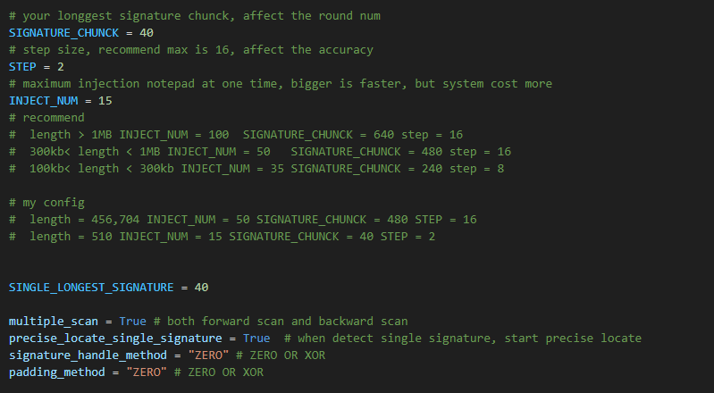

# Signature Locate
Inject malicious code into Notepad and use antivirus software memory scanning to automatically locate memory signature codes.  
向notepad注入恶意代码，利用杀软进行内存扫描自动化定位内存特征码。  
It is recommended to locate the signature of shellcode.   
推荐对shellcode进行特征码定位。  
 
# Config
The injection module of this project comes from my friend's [Memccl](https://github.com/Adnnlnistrator/Memccl), so inject.py needs to be in the same directory as Signature_Locate.py.  
该项目注入模块来自朋友的[Memccl](https://github.com/Adnnlnistrator/Memccl)，因此inject.py需要和Signature_Locate.py处于同一目录。  

You need to set the relevant parameters manually.  
你需要手动设定相关参数。  



# Usage
Encrypt file, use ```python enc.py <file>``` to get ```file.enc```.  
先对目标文件加密，```python enc.py <file>``` 得到 ```file.enc```。  
then ```python Signature_Locate.py file.enc```

# Anti-virus products
Currently only compatible with Kaspersky, you can modify the scan command to adapt to the target antivirus software.   
当前仅适配卡巴斯基，你可以通过的修改扫描指令来适配目标杀软。  

  

Kaspersky need turn Advanced cleaning technology off.  
卡巴斯基需要关闭高级清除技术。  

  

# Output
For single-signature matching items, the specific position is matched and the error is one STEP.  
对于单特征码匹配项，匹配具体位置，误差为一个STEP。  
For multi-feature code matching items, only one of the multiple features needs to be eliminated, so only the position of the STEP length of one of the features will be provided.  
对于多特征码匹配项，只需消除多特征中的一项即可，因此只会提供其中一项STEP长度的位置。  
Encrypt the memory anti-virus code and output it to output_shellcode.bin, and decrypt it using enc.py.  
将内存免杀的代码加密并输出到output_shellcode.bin，使用enc.py解密。  

# Other
The larger the target is, the more time it takes.  
免杀目标越大，消耗的时间越多。  
In the case of heuristic scanning (for example, the entropy value is too high), this tool is currently unable to locate the signature code.  
被启发式扫描查杀(比如熵值过高)的情况，该工具目前无法定位特征码。  
This project is currently in its early stages, and we hope you will give us your comments and suggestions.  
该项目目前处于早期版本，希望大家多多提意见和建议。  
 
# Example
Use MSF to generate shellcode for testing.  
使用MSF生成shellcode的进行测试。  
```
C:\Users\username\Desktop>python Signature_Locate.py shellcode.bin.enc
--------------------------------------------
iterate_process, start position: 0, end position: 510
chunk size: 40, pre_pos: 40, pos: 80
head scan, start position: 40
tail_pos: 64
detect single signature
head scan, start position: 22
tail_pos: 64
tail scan, start position: 64
head_pos: 44
find signature, ZERO range start: 44, end: 64
--------------------------------------------
iterate_process, start position: 0, end position: 510
chunk size: 40, pre_pos: 320, pos: 360
head scan, start position: 320
tail_pos: 334
find signature, ZERO range start: 332, end: 334
--------------------------------------------
iterate_process, start position: 0, end position: 510
chunk size: 40, pre_pos: 360, pos: 400
head scan, start position: 360
tail_pos: 374
find signature, ZERO range start: 372, end: 374
--------------------------------------------
iterate_process, start position: 0, end position: 510
chunk size: 40, pre_pos: 400, pos: 440
head scan, start position: 400
tail_pos: 410
find signature, ZERO range start: 408, end: 410
--------------------------------------------
iterate_process, start position: 0, end position: 510
chunk size: 40, pre_pos: 400, pos: 440
head scan, start position: 400
tail_pos: 436
find signature, ZERO range start: 434, end: 436
--------------------------------------------
iterate_process, start position: 0, end position: 510
chunk size: 40, pre_pos: 440, pos: 480
head scan, start position: 440
tail_pos: 474
find signature, ZERO range start: 472, end: 474
Shellcode written to output_shellcode.bin, decryption key: 67
Signature locate finished, result:
[[44, 64], [332, 334], [372, 374], [408, 410], [434, 436], [472, 474]]
```
