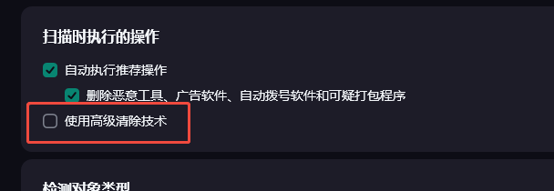

# Signature Locate
Inject malicious code into Notepad and use antivirus software memory scanning to automatically locate memory signature codes.  
向notepad注入恶意代码，利用杀软进行内存扫描自动化定位内存特征码。  
It is recommended to locate the signature of shellcode.   
推荐对shellcode进行特征码定位。  
 

# Update

## 2025.6.13
1. Added bidirectional scanning function/增加双向扫描功能
2. Improved locate logic/改进定位逻辑

# Config
The injection module of this project comes from my friend's [Memccl](https://github.com/Adnnlnistrator/Memccl), so inject.py needs to be in the same directory as Signature_Locate.py.  
该项目注入模块来自朋友的[Memccl](https://github.com/Adnnlnistrator/Memccl)，因此inject.py需要和Signature_Locate.py处于同一目录。  

You need to set the relevant parameters manually.  
你需要手动设定相关参数。  

Choose signature and padding method.  
选择特征码和填充的处理方式。  

You can turn off the function you don't need by set it's False.  
你可以通过将不需要的功能设置为 False 来关闭它。  
multiple scan has both forward scan and backward scan, But it will increase the scanning time。Poor performance when handling PE files.  
多重扫描可以同时向前和向后扫描，它会增加扫描时间。在处理PE文件的时候表现不佳。  
precise locate single signature means when detect single signature, start precise locate.  
单特征码精准定位可以在检测到单特征码的时候进行精准定位。  


# Usage
Encrypt file, use ```python enc.py <file>``` to get ```file.enc```.  
先对目标文件加密，```python enc.py <file>``` 得到 ```file.enc```。  
then ```python Signature_Locate.py file.enc```

# Anti-virus products
Currently only compatible with Kaspersky, you can modify the scan command to adapt to the target antivirus software.   
当前仅适配卡巴斯基，你可以通过的修改扫描指令来适配目标杀软。  

  

Kaspersky need turn Advanced cleaning technology off.  
卡巴斯基需要关闭高级清除技术。  

  

# Output
For single-signature matching items, the specific position is matched and the error is one STEP.  
对于单特征码匹配项，匹配具体位置，误差为一个STEP。  
For multi-signature code matching items, only one of the multiple signature needs to be eliminated, so only the position of the STEP length of one of the signature will be provided.  
对于多特征码匹配项，只需消除多特征中的一项即可，因此只会提供其中一项STEP长度的位置。  
Bidirectional scanning will provide separate results and file. The final signature code requires comprehensive judgment.  
双向扫描会提供各自的结果和文件，最终特征码需要进行综合判断。  
Encrypt the memory anti-virus code and output it to output_shellcode.bin, and decrypt it using enc.py.  
将内存免杀的代码加密并输出到output_shellcode.bin，使用enc.py解密。  

# Other
The larger the target is, the more time it takes.  
免杀目标越大，消耗的时间越多。  
In some special cases, the tool cannot correctly locate the signature.  
在个别特殊情况，工具无法正确定位特征码。    
This project is currently in its early stages, and we hope you will give us your comments and suggestions.  
该项目目前处于早期版本，希望大家多多提意见和建议。 

Sometime, you need choose different method.  
有时，你需要选择不同的处理方式。  


# Example
Use MSF to generate shellcode for bidirectional scanning testing.  
使用MSF生成shellcode进行双向扫描测试。  
> CONFIG  
> multiple_scan = True # both forward scan and backward scan  
> precise_locate_single_signature = True  # when detect single signature, start precise locate  
> signature_handle_method = "ZERO" # ZERO OR XOR  
> padding_method = "XOR" # ZERO OR XOR   
```
C:\Users\miunasu\Desktop>python Signature_Locate.py shellcode.bin.enc
--------------------------------------------
find signature in bakcward scan, ZERO range start: 406, end: 408

--------------------------------------------
detect single signature, start precise location
precise location result:
head_pos: 44, tail_pos: 64

--------------------------------------------
find signature in forward scan, ZERO range start: 44, end: 64

--------------------------------------------
find signature in bakcward scan, ZERO range start: 276, end: 278

--------------------------------------------
find signature in forward scan, ZERO range start: 332, end: 334

--------------------------------------------
find signature in bakcward scan, ZERO range start: 260, end: 262

--------------------------------------------
find signature in forward scan, ZERO range start: 372, end: 374

--------------------------------------------
find signature in forward scan, ZERO range start: 408, end: 410

--------------------------------------------
detect single signature, start precise location
precise location result:
head_pos: 44, tail_pos: 64

--------------------------------------------
find signature in bakcward scan, ZERO range start: 44, end: 64

--------------------------------------------
find signature in forward scan, ZERO range start: 434, end: 436

--------------------------------------------
find signature in forward scan, ZERO range start: 472, end: 474

Shellcode written to output_backward_scan_shellcode.enc, decryption key: 0x43
Backward signature locate finished, result:
[[406, 408], [276, 278], [260, 262], [44, 64]]
Shellcode written to output_forward_scan_shellcode.enc, decryption key: 0x43
Forward signature locate finished, result:
[[44, 64], [332, 334], [372, 374], [408, 410], [434, 436], [472, 474]]
```
